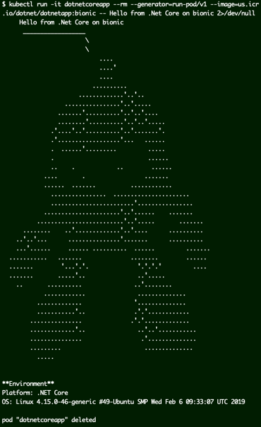

## Build and deploy a sample .Net Core application in IBM Cloud

##### Pre-requisites
1. Install [Docker](https://docs.docker.com/install) on your development machine.

2. Install [kubectl](https://kubernetes.io/docs/tasks/tools/install-kubectl/)

3. [Sign-up](https://cloud.ibm.com/registration) for an IBM Cloud account, or [login](https://cloud.ibm.com/login) to your existing account.

4. [Create](https://cloud.ibm.com/kubernetes/catalog/cluster/create) a new IBM Cloud Kubernetes Service (IKS) Free or Standard cluster with Ubuntu worker nodes, or use an existing cluster.

5. Install [IBM Cloud CLI](https://cloud.ibm.com/docs/cli/reference/ibmcloud?topic=cloud-cli-install-ibmcloud-cli#shell_install)

6. Log into your IBM Cloud account using __ibmcloud__ CLI
```
$ ibmcloud login
```

6. Install IBM Cloud Container Regsitry plugin
```
$ ibmcloud plugin install container-registry -r 'IBM Cloud'
```

7. Log into IBM Cloud Container Registry
```
$ ibmcloud cr login
```

8. Create a new container registry namespace
```
$ ibmcloud cr namespace-add dotnet
```

9. Install IBM Cloud Kubernetes service plugin
```
$ ibmcloud plugin install container-service -r 'IBM Cloud'
```

10. Initialize IBM Cloud Kubernetes service plugin
```
$ ibmcloud ks init
```

11. Download IKS cluster config and set kubectl context
```
$ eval $(ibmcloud ks cluster-config <your-iks-cluster-name> | tail -2 | head -1)
```

12. Verify kubectl is set to use your IKS cluster
```
$ kubectl config current-context
```

##### Upload .Net Core app container image to IBM Container Registry (ICR)
Get .Net Core application sample code from a public git repo. Create a Dockerfile to build the container image using the sample application files and upload the image to IBM Container Registry. Finally, to validate run a Pod in IKS cluster using the container image hosted on ICR.

1. Download sample code
```
$ git clone https://github.com/dotnet/dotnet-docker/
$ cd dotnet-docker/samples/dotnetapp
```

2. This dotnetapp sample includes various Dockerfiles to build container images for different platforms. Modify Dockerfile to use `bionic` tag to build a container image to run on Ubuntu 18.04 worker nodes.
```
$ sed 's/:2.2/:2.2-bionic/g' Dockerfile > Dockerfile.bionic
```

3. Build container image
```
$ docker build --pull -t dotnetapp:bionic -f Dockerfile.bionic .
```

4. Validate the container image works
```
$ docker run --rm -it dotnetapp:bionic Hello .NET Core from Bionic
```

5. Tag and upload container image to IBM Cloud Container Registry
```
$ docker tag dotnetapp:bionic us.icr.io/dotnet/dotnetapp:bionic
$ docker push us.icr.io/dotnet/dotnetapp:bionic
```

6. Validate container image hosted on IBM Cloud Container Registry works
```
$ docker run --rm -it us.icr.io/dotnet/dotnetapp:bionic Hello .NET Core from Bionic
```

##### Run .Net Core sample app in IKS using image in ICR
Using kubectl run a new pod created from the container image uploaded to ICR. Terminate the pod after execution is complete.
```
$ kubectl run -it dotnetcoreapp --rm --generator=run-pod/v1 --image=us.icr.io/dotnet/dotnetapp:bionic -- Hello from .Net Core on bionic 2>/dev/null
```
  

This demonstrates that a .Net Core application can run successfully in IBM Cloud.
